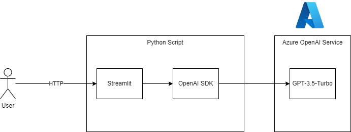

# Repository for LLM intro session

This repository should give attendees an overview of the LLM development ecosystem and should demonstrate how to solve basic use cases with the appropriate tools. The intention is to use the Azure OpenAI service as an LLM and to vary the different frameworks available to build usecases.

An overview of tools and frameworks could be found here:

(source: <https://twitter.com/chiefaioffice/status/1717614624793927972/photo/1>)

Before we dive into the possibilities of how we can code our own applications that uses LLMs and models, we should first have a look at how those models can help use to write this application code. So we will frist have a look at "Coding with AI assistance".

## Coding with AI assistance

### VS Code plugin

One option to integrate coding assistance into your VSCode environment is to load the VSCode OpenAI plugin from:
<https://marketplace.visualstudio.com/items?itemName=AndrewButson.vscode-openai>. The plugin supports OpenAI and Azure OpenAI Service endpoints and can be configured easily for source code optimizations or chat with the LLM for code generation.

Interesting features of the plugin are e.g. chat for source code generation or source code optimization / comments:

- Plugin options

- Chat view for code generation

- Menu options per file for optimization


### Aider

Aider is a commandline based tool to help you with coding tasks.

To use Aider, install it with pip:

```powershell
pip install aider-chat
```

To use Aider with Azure OpenAI Service, create a .aider.conf.yml file in your root Git directory (add it to .gitignore)  and add the following values:

```powershell
openai-api-type: azure
openai-api-key: {YOUR-AZURE-KEY}
openai-api-base: https://{YOUR-API-ENDPOINT}.openai.azure.com
openai-api-version: 2023-05-15
openai-api-deployment-id: {YOUR-DEPLOYMENT-NAME}
```

Aider helps you with basic coding tasks like code generation, code optimization, documentation, etc on a command line interface and with full Git integration. This repository contains the file aider-demo.py that was completly generated with the help of Aider. The following steps created the sample file:


## Step 0: The basics

To understand how a LLM as a mathematical model can work with text data, the file 0-basics.py shows, how we can utilize embedding models to convert a sequence of words of variable lenght to a representative embedding vector with a fixed lenght (or dimension). This embedding vector represents the full semantics of the text and similitary with other text passages can be mathmatically evaluated by calculating the cosine similarity. In the sample file this is demonstrated with the text embedding model from Azure OpenAI service. To calculate the similarity between the texts the cosine similarity is used since this is the suggest method from OpenAI for their embeddings. The higher the cosine similarity in comparision to other scores is, the higher is also the relation between the two text.

To run the sample and sea the calculations run

```powershell
python 0-basics.py
```

## Sample 1: ChatGPT clone with OpenAI and Streamlit

To demonstrate, how OpenAI and Streamlit work together to give you visual access to an Azure OpenAI service instance, please review deep-dive-openai.py. With the OpenAI SDK you can control the parameters of the model call, including the temperature value (from 0 with less creativity to 1 with high creativity and hallucination risk)

Within this solution Streamlit acts as a web server that generates a web frontend for the user. When the user inputs its text to the input textbox, this questions is sent to Azure OpenAI service through the Open AI Python SDK. The response and all previous messages were managed by the application to and sent as the history to the service.



The script needs the following .env variables:

- AZURE_OAI_BASE_URL (your Azure OpenAI service deployment in the format of https://{YOUR-TENANT-HERE}.openai.azure.com)
- AZURE_OAI_KEY (your Azure OpenAI key)
- AZURE_OAI_DEPLOYMENTNAME (your Azure OpenAI deployment)

To run the sample use:

```powershell
streamlit run 1-deep-dive-openai.py
```

The file was inspired by: <https://github.com/microsoft/az-oai-chatgpt-streamlit-harness>

## Sample 2: Chat with your PDF with Langchain and Streamlit

To enhace the first example, in this sample we add our own PDF knowledge to the chat with the GPT modell.

For this, we use a Langchain implementation for Retrieval Augmented Generation (RAG) with its ConversationalRetrievalChain, PyPDF to read the PDF file containing our knowledge base and FAISS vector store to store vectorized information about the PDF. Vectorization is done via chunking the whole document into single page chunks that were embedded during initialization with the OpenAI embedding modell and the resulting vectors were stored within the FAISS store (light gray lines). During answering the users questions, LangChains retrieval chain uses the user query, vectorizes this question and retrieves relevant passages of the PDF from FAISS. This relevant context is feed into the prompt to the GPT modell which than is able to answer based on the knowledge of the PDF (black lines).


The script needs the following .env variables:

- AZURE_OAI_BASE_URL (your Azure OpenAI service deployment in the format of https://{YOUR-TENANT-HERE}.openai.azure.com)
- AZURE_OAI_KEY (your Azure OpenAI key)
- AZURE_OAI_DEPLOYMENTNAME (your Azure OpenAI deployment)
- AZURE_OAI_EMBEDDINGMODELL (your Azure OpenAI text embedding deployment)
- RAG_FILENAME (the path to your PDF file containing the knowledge for the RAG application)

To run the sample use:

```powershell
streamlit run 2-deep-dive-langchain-rag.py
```

The file was inspired by: <https://github.com/yvann-ba/Robby-chatbot>

## Sample 3: Chat with your PDF with Haystack and Huggingface models

Sample 2 with Langchain uses the models from OpenAI from Azure OpenAI service and simply relies on Embedding Search for the RAG approach. For some use cases smaller or specialized models and a hybrid RAG search approach can enhace RAG performance.

For this we use the Haystack framework to build a hybrid retrieval pipeline that consists of a document store and a retrieval pipeline. The document store is filled with data from a PDF file, that is preprocessed by chunking the whole document in smaller portions of the content. The document store is the basis for a BM25 sparse retriever (classical search by keywords) and a dense retriever doing vector search with an embedding model loaded from Huggingface (<https://huggingface.co/sentence-transformers/all-MiniLM-L6-v2>). The search results of both retrievers is in the pipeline combined via a document join and then the result is reranked and filtered by another Huggingface model (<https://huggingface.co/cross-encoder/ms-marco-MiniLM-L-6-v2>). The result is an ordered list of document chunks, sorted by relevance with their relevance score. This collection of document chunks is then finally injected in a GPT3.5 Turbo prompt via the Promptnode. As the result of this pipeline the LLM response is then sent back.

For the visualization of the user interaction we use Gradio this time. Gradio is another UI framework like Streamlit, but very easy to use. Important to know when you want to use Gradio and Haystack together in the same application is that the latest versions of both frameworks were not compatible with each other. For me the version 1.22.1 of farm-haystack and Gradio version 3.50.2 work together.


To run the sample use:

```powershell
python 3-deep-dive-haystack.py
```
